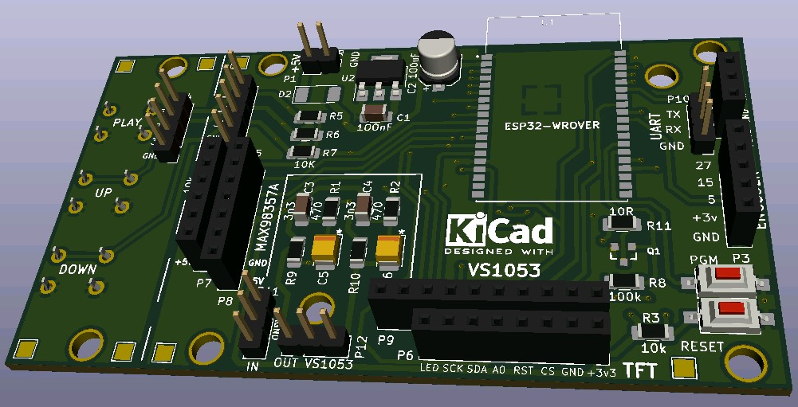
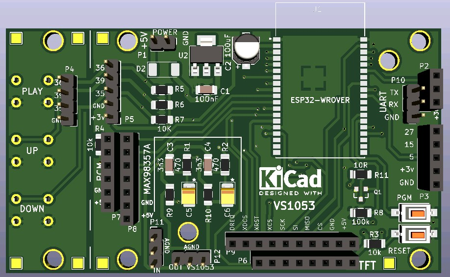
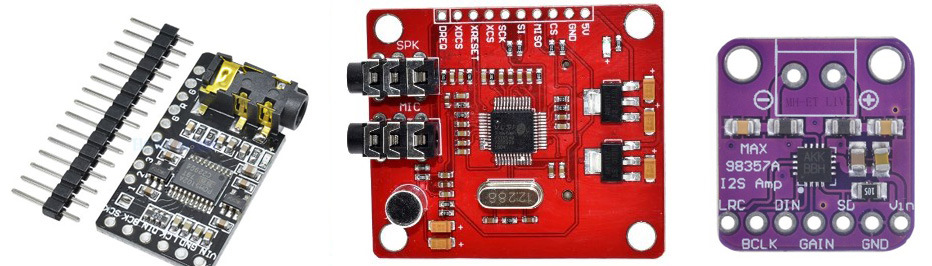
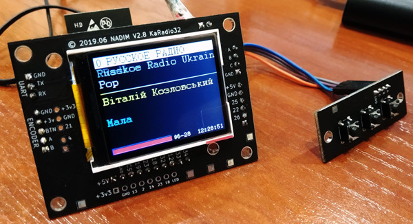

# PCB-KaRadio32
A universal version of the board for KaRadio32 to which you can connect a PCM5102 DAC or VS1053 decoder, as well as connect an Adafruit-MAX98357 I2S 3W class D amplifier.

PCB for Internet radio project on ESP32
https://github.com/karawin/Ka-Radio32

**My blogs:**
https://nadim.top/karadio32-internet-radio

https://www.youtube.com/channel/UCarcEsRznbQQ0N_8AkVWOOA

**DAC PCM5102** - if you need to reduce the cost and get a stereo signal (mp3 and the ability to listen to AAC stations)

**VS1053 decoder** - full stuffing (mp3 and AAC stations work fine)

**MAX98357** I2S 3 W - mono amplifier - below is a video with its review (mp3 and the ability to listen to AAC stations)

**Display TFT 1.8 ST7735S**

